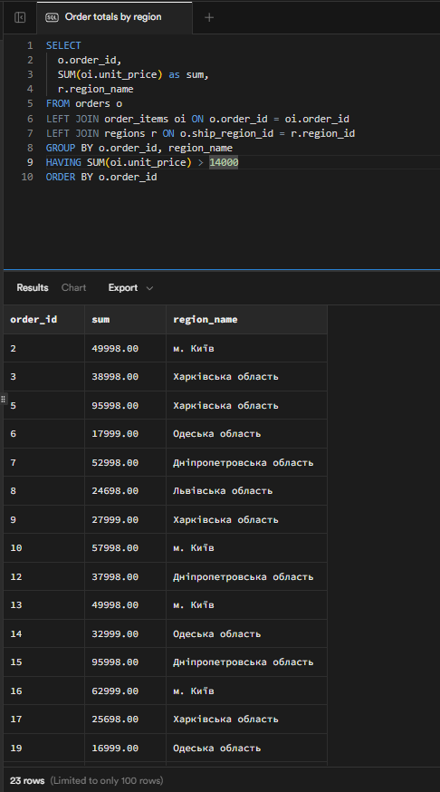
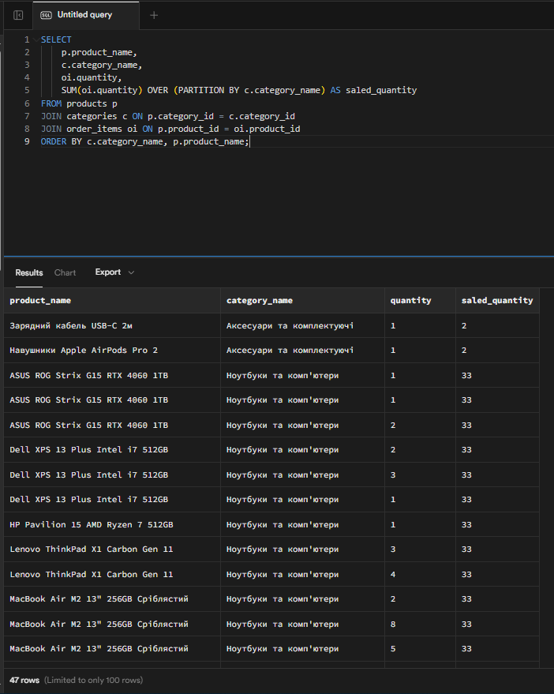

# Лабораторна робота 2. Створення складних SQL запитів

## Загальна інформація

**Здобувач освіти:** [Шипкін Денис]
**Група:** [ІПЗ-32]
**Обраний рівень складності:** [3]

## Виконання завдань

### Рівень 1

**Завдання 1.1:** INNER JOIN - список товарів з категоріями та постачальниками
```sql
SELECT p.product_name, c.category_name, s.company_name, p.unit_price
FROM products p
JOIN categories c ON p.category_id = c.category_id
JOIN suppliers s ON p.supplier_id = s.supplier_id
ORDER BY c.category_name, p.product_name;
```

**Результат виконання:**

**Пояснення:** Запит об'єднує три таблиці - products, category і suppliers, в одну за значенням відповідних ID в кожній з таблиць.


**Завдання 1.2:** LEFT JOIN - клієнти з кількістю замовлень
```sql
-- Детальний приклад з поясненнями
SELECT 
  c.contact_name, 
  c.customer_type, 
  r.region_name,
  COUNT(o.order_id) as order_count
FROM customers c
LEFT JOIN orders o ON c.customer_id = o.customer_id
LEFT JOIN regions r ON c.region_id = r.region_id
GROUP BY c.customer_id, c.contact_name, c.customer_type, r.region_name
ORDER BY order_count DESC;
```

**Результат виконання:**

**Пояснення:** Основна відмінніть - звичайний JOIN поєднує таблиці лише за спільним, в той час як LEFT JOIN витягує усі рядки з лівої (першої) таблиці і лише те з правої таблиці, що саме запитує запит.


**Завдання 1.3:** Множинне з'єднання - детальна інформація про замовлення
```sql
SELECT
  o.order_id,
  o.order_date,
  o.ship_name as customer_name,
  p.product_name,
  c.category_name,
  s.company_name as supplier,
  oi.quantity,
  oi.unit_price
FROM orders o
  JOIN order_items oi ON o.order_id = oi.order_id
  JOIN products p ON oi.product_id = p.product_id
  JOIN categories c ON p.category_id = c.category_id
  JOIN suppliers s ON p.supplier_id = s.supplier_id
ORDER BY order_id, product_name
```

**Результат виконання:**


**Аналіз складності:** Власне, порядок з'єднання таблиць співпадає з порядком написання JOIN-ів: спочатку orders з order_intems, далі до них доєднується products, далі categories і, на кінець, таблиця suplliers.


**Завдання 1.4:** Статистика товарів за категоріями
```sql
SELECT c.category_name,
  COUNT(p.product_id) as product_count,
  AVG(p.unit_price) as avg_price
FROM categories c
LEFT JOIN products p ON c.category_id = p.category_id
GROUP BY c.category_id, c.category_name
ORDER BY product_count DESC;
```

**Результат виконання:**


**Завдання 1.5:** Продажі за регіонами з використанням HAVING
```sql
SELECT
  o.order_id,
  SUM(oi.unit_price) as sum,
  r.region_name
FROM orders o
LEFT JOIN order_items oi ON o.order_id = oi.order_id
LEFT JOIN regions r ON o.ship_region_id = r.region_id
GROUP BY o.order_id, region_name
HAVING SUM(oi.unit_price) > 14000
ORDER BY o.order_id
```

**Результат виконання:**


**Завдання 1.6:** Створити запит з GROUP BY для групування даних за різними критеріями
```sql
SELECT
    c.category_name,
    COUNT(DISTINCT p.product_id) AS count_unique_products,
    SUM(oi.quantity) AS sale_quantity,
    SUM(oi.unit_price * oi.quantity * (1 - oi.discount)) AS general_income
FROM categories c
JOIN products p ON c.category_id = p.category_id
JOIN order_items oi ON p.product_id = oi.product_id
JOIN orders o ON oi.order_id = o.order_id
WHERE o.order_status = 'delivered' -- Враховуємо лише доставлені замовлення
GROUP BY c.category_name
ORDER BY general_income DESC;
```

**Результат виконання:**


**Завдання 1.7:** Створити підзапит у розділі WHERE для фільтрації записів
```sql
SELECT
    p.product_id,
    p.product_name,
    c.category_name
FROM products p
JOIN categories c ON p.category_id = c.category_id
WHERE p.product_id IN (
    SELECT
        oi.product_id
    FROM order_items oi
    JOIN orders o ON oi.order_id = o.order_id
    JOIN customers c ON o.customer_id = c.customer_id
    WHERE c.customer_type = 'company'
)
ORDER BY p.product_id;
```

**Результат виконання:**

### Примітка: це запит можна реалізувати і без вбудованого підзапиту.


**Завдання 1.8:** Використати підзапит у розділі SELECT для додавання обчислювальних полів
```sql
SELECT
    p.product_id,
    p.product_name,
    p.unit_price,
    ROUND (
      (
        SELECT
          AVG(oi.unit_price)
        FROM order_items oi
        JOIN orders o ON oi.order_id = o.order_id
        WHERE oi.product_id = p.product_id AND o.order_status = 'delivered'
      ), 2) AS avg_unit_price,
    p.units_in_stock
FROM products p
ORDER BY p.product_id;
```

**Результат виконання:**


**Завдання 1.9:** Реалізувати запит з використанням оператора EXISTS
```sql
SELECT
    c.customer_id,
    c.contact_name,
    c.city
FROM customers c
WHERE EXISTS (
    SELECT 1
    FROM orders o
    JOIN order_items oi ON o.order_id = oi.order_id
    WHERE o.customer_id = c.customer_id AND oi.quantity > 1
)
ORDER BY c.customer_id;
```

**Результат виконання:**


### Рівень 2


**Завдання 2.1.1:** Запит з RIGHT JOIN
```sql
SELECT c.category_name,
  COUNT(p.product_id) as products_count,
  COALESCE(ROUND(AVG(p.unit_price), 2), 0) as avg_price
FROM products p
RIGHT JOIN categories c ON p.category_id = c.category_id
GROUP BY c.category_id, c.category_name
ORDER BY products_count DESC;
```

**Результат виконання:**


**Завдання 2.1.2:** Запит з FULL JOIN
```sql
SELECT
    s.supplier_id,
    s.company_name as supplier,
    p.product_id,
    p.product_name
FROM suppliers s
FULL JOIN products p ON s.supplier_id = p.supplier_id
ORDER BY s.company_name, p.product_name;
```

**Результат виконання:**


**Завдання 2.2:** Реалізувати самоз'єднання (self-join) таблиці
```sql
SELECT e1.first_name || ' ' || e1.last_name as employee,
      e1.title as employee_title,
      e2.first_name || ' ' || e2.last_name as manager,
      e2.title as manager_title
FROM employees e1
LEFT JOIN employees e2 ON e1.reports_to = e2.employee_id
ORDER BY e2.last_name, e1.last_name;
```

**Результат виконання:**


**Завдання 2.3:** Створити запит з умовним з'єднанням (з додатковими умовами в ON)
```sql
SELECT
    oi.order_id,
    p.product_name,
    p.unit_price,
    oi.unit_price,
    oi.discount
FROM products p
LEFT JOIN order_items oi
    ON p.product_id = oi.product_id
   AND oi.discount > 0.00
ORDER BY oi.order_id, p.product_name;
```

**Результат виконання:**


**Завдання 2.4:** Використати ROW_NUMBER(), RANK(), DENSE_RANK() для ранжування
```sql
SELECT p.product_name,
  c.category_name,
  p.unit_price,
  RANK() OVER (PARTITION BY c.category_name ORDER BY p.unit_price DESC) as price_rank,
  DENSE_RANK() OVER (PARTITION BY c.category_name ORDER BY p.unit_price DESC) as price_dense_rank,
  ROW_NUMBER() OVER (PARTITION BY c.category_name ORDER BY p.unit_price DESC) as row_num
FROM products p
JOIN categories c ON p.category_id = c.category_id
ORDER BY c.category_name, p.unit_price DESC;
```

**Результат виконання:**


**Завдання 2.5:** Застосувати LAG(), LEAD() для порівняння з попередніми/наступними записами
```sql
SELECT
    order_date,
    freight,
    LAG(freight, 1, 0) OVER (ORDER BY order_date) as prev_freight,
    LEAD(freight, 1, 0) OVER (ORDER BY order_date) as next_freight,
    freight - LAG(freight, 1, 0) OVER (ORDER BY order_date) as freight_change
FROM orders
ORDER BY order_date;
```

**Результат виконання:**


**Завдання 2.6:** Створити запити з PARTITION BY для аналізу в розрізах
```sql
SELECT
    p.product_name,
    c.category_name,
    oi.quantity,
    SUM(oi.quantity) OVER (PARTITION BY c.category_name) AS saled_quantity
FROM products p
JOIN categories c ON p.category_id = c.category_id
JOIN order_items oi ON p.product_id = oi.product_id
ORDER BY c.category_name, p.product_name;
```

**Результат виконання:**



### РІВЕНЬ 3
**Завдання 3.1:** Створити матеріалізоване представлення (materialized view) для складного запиту
```sql
CREATE MATERIALIZED VIEW mv_monthly_sales AS
SELECT
    EXTRACT(YEAR FROM o.order_date) as year,
    EXTRACT(MONTH FROM o.order_date) as month,
    c.category_name,
    r.region_name,
    SUM(oi.quantity * oi.unit_price * (1 - oi.discount)) as total_revenue,
    COUNT(DISTINCT o.order_id) as orders_count,
    ROUND(AVG(oi.quantity * oi.unit_price * (1 - oi.discount)), 2) as avg_order_value
FROM orders o
JOIN order_items oi ON o.order_id = oi.order_id
JOIN products p ON oi.product_id = p.product_id
JOIN categories c ON p.category_id = c.category_id
JOIN customers cu ON o.customer_id = cu.customer_id
LEFT JOIN regions r ON cu.region_id = r.region_id
WHERE o.order_status = 'delivered'
GROUP BY year, month, c.category_name, r.region_name;

CREATE INDEX idx_mv_monthly_sales_date ON mv_monthly_sales(year, month);
```

**Результат виконання:**


**Що відбулось:** Було створене матеріалізоване представлення складного запиту, грубо кажучи - це збережені результати запиту.


**Завдання 3.2:** Реалізувати рекурсивний запит з використанням CTE (Common Table Expression)
```sql
WITH RECURSIVE employee_hierarchy AS (
    -- Anchor query (базовий випадок): початкові менеджери
    SELECT employee_id, first_name, last_name, reports_to,
           0 as level,
           first_name || ' ' || last_name as hierarchy_path
    FROM employees
    WHERE reports_to IS NULL

    UNION ALL

    -- Recursive query (рекурсивний випадок): знаходимо підлеглих
    SELECT e.employee_id, e.first_name, e.last_name, e.reports_to,
           eh.level + 1,
           eh.hierarchy_path || ' -> ' || e.first_name || ' ' || e.last_name
    FROM employees e
    INNER JOIN employee_hierarchy eh ON e.reports_to = eh.employee_id
    WHERE eh.level < 10
)
SELECT employee_id, first_name, last_name, level, hierarchy_path
FROM employee_hierarchy
ORDER BY level, last_name;
```

**Результат виконання:**


**Логіка запиту:** Перед UNION ALL написаний перший випадок, тобто перше виконання. Далі запит, у якому employee_hierarchy посилається сама на себе, буде виконуватись до тих пір, поки eh.level < 10. Ця умова зупинки дуже важлива, адже якщо її не прописати, можна отримати зациклення.


**Завдання 3.3:** Створити запит з динамічним SQL або збереженою процедурою для параметризованої аналітики
```sql
CREATE OR REPLACE FUNCTION get_employee_sales(
    target_employee_id INTEGER, 
    start_date DATE, 
    end_date DATE
)
RETURNS DECIMAL
LANGUAGE SQL
AS $$
    SELECT
        COALESCE(SUM(oi.quantity * oi.unit_price * (1 - oi.discount)), 0)
    FROM orders o
    JOIN order_items oi ON o.order_id = oi.order_id
    WHERE o.employee_id = target_employee_id
      AND o.order_date BETWEEN start_date AND end_date
      AND o.order_status = 'delivered';
$$;
```
### Вище - функція, шаблон, який буде виконувати операції з різними даними. Вона нічого не виводить.

```sql
SELECT get_employee_sales(2, '2024-01-01', '2024-06-30');
```
### А це вже - виклик функції, який уже має вивід:


**Логіка запиту:** Спочатку запит створює функцію, якій задаються кількість і тип вхідних параматерів і, власне, що буде виконувати ця функція.


**Самооцінка**: [5]

**Обгрунтування**: [При потребі, я можу пояснити логіку кожного із запитів]
