# Звіт з лабораторної роботи №6

## Загальна інформація
- ПІБ студента: Шипкін Денис.
- Група: ІПЗ-32.
- Рівень виконання: 3.

# РІВЕНЬ 1
## Крок 1-2: Встановлення MongoDB та підключення ло MongoDB.
Спочатку я MongoDB за посиланням з методички та обов'язково поставив галочку для встановлення графічного інтейрфейсу MongoDB Compass (для кращої зручності роботи). 
Наступнив кроком я, власне, запустив цей графічний інтерфейс та підключився до mongodb://localhost:27017:
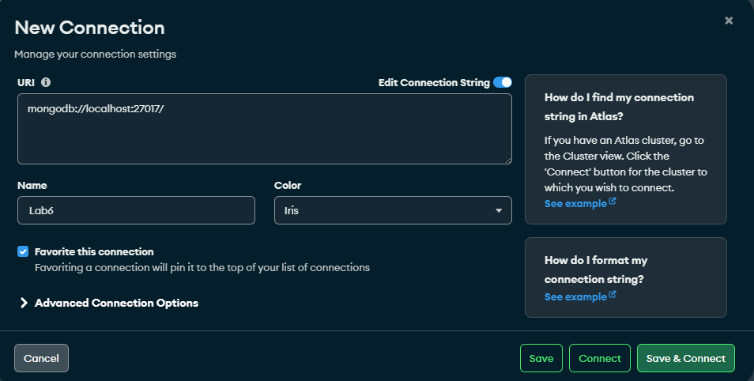
Під'єднання пройшло успішно.


## Крок 3: Створення бази даних та колекцій.
Для початку необхідно прописати use library щоб створити нову БД. 
Далі прописати код створення колекцій:
```js
db.createCollection("books", {
  validator: {
    $jsonSchema: {
      bsonType: "object",
      required: ["title", "author", "publication_year"],
      properties: {
        title: { bsonType: "string" },
        author: { bsonType: "string" },
        publication_year: { bsonType: "int", minimum: 1000 },
        pages: { bsonType: "int", minimum: 1 },
        genres: { bsonType: "array", items: { bsonType: "string" } },
        available: { bsonType: "bool" }
      }
    }
  }
});

db.createCollection("authors");
db.createCollection("users");
```

Бажано прописувати створення кожної колекції окремо, у висновку чого при успішному завершенні отримаємо ось такий вивід:
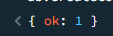


## Крок 4: Заповнення колекцій даними.
Я не буду вставляти весь код з методички, бо він величенький.
Отож, я вставлю лише фрагмент для вставки інформації в одну з колекцій:
```js
db.authors.insertMany([
  {
    name: "Тарас Шевченко",
    birth_year: 1814,
    death_year: 1861,
    nationality: "український",
    biography: "Найвідоміший український поет, письменник, художник"
  },
  {
    name: "Леся Українка",
    birth_year: 1871,
    death_year: 1913,
    nationality: "український",
    biography: "Видатна українська письменниця, поетеса"
  },
  {
    name: "Іван Франко",
    birth_year: 1856,
    death_year: 1916,
    nationality: "український",
    biography: "Письменник, поет, публіцист, перекладач"
  },
  {
    name: "Михайло Коцюбинський",
    birth_year: 1864,
    death_year: 1913,
    nationality: "український",
    biography: "Український письменник-модерніст"
  },
  {
    name: "Панас Мирний",
    birth_year: 1849,
    death_year: 1920,
    nationality: "український",
    biography: "Український письменник-реаліст"
  }
]);
```

При успішному завершенні отримаємо такий вивід:
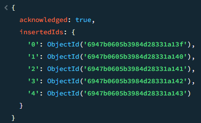

Такі самі процедури треба провести із колекції книжок і користувачів.


## Крок 5: Виконання базових CRUD операцій.
Якщо проводити аналогію, то це звичайна вибірка/оновлення/вставлення даних.
Я не буду всі вставляти сюди, лише декілька:
### 1
```js
db.books.find({ author: "Іван Франко" });
```
### Результат:

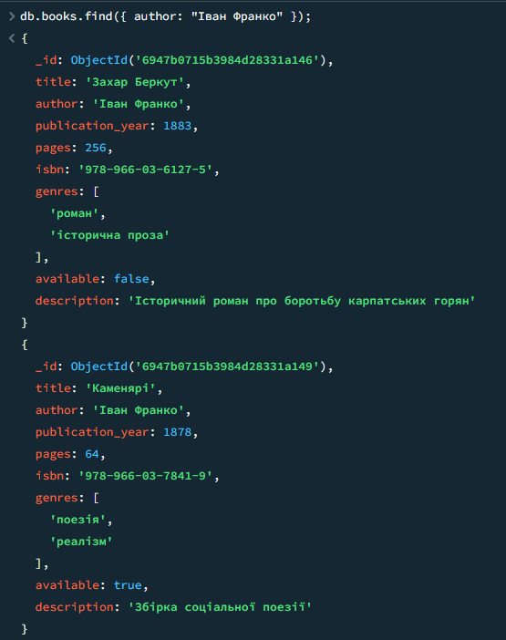

### 2
```js
db.books.find({ genres: "поезія" });
```
### Результат:

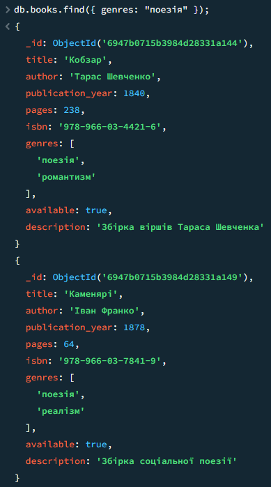

### 3
```js
db.books.find({
  $or: [
    { author: "Тарас Шевченко" },
    { genres: "романтизм" }
  ]
});
```
### Результат:

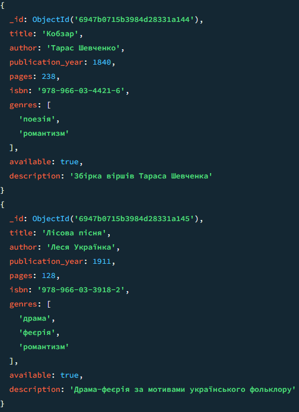
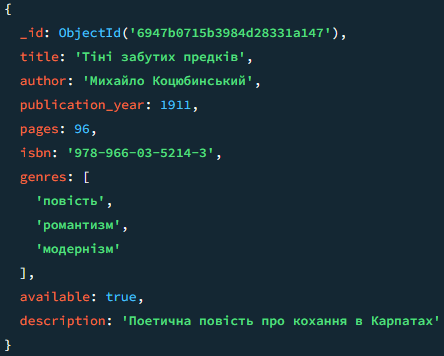

### 4
```js
db.books.updateOne(
  { title: "Кобзар" },
  { $set: { available: false } }
);
```
### Результат:

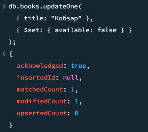

### 5
```js
db.books.updateMany(
  { publication_year: { $lt: 1900 } },
  { $set: { category: "класика XIX століття" } }
);
```
### Результат:

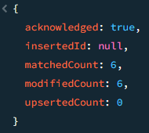

### 6
```js
db.books.deleteMany({ available: false, publication_year: { $lt: 1850 } });
```
### Результат:

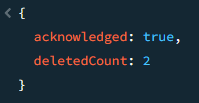


## Крок 6: Створення індексів.
Наглядно буде перевірити, який запит виконається швидше: індексований чи звичайний.
Перед цим треба створити індекс:
```js
db.books.createIndex({ author: 1 });
```
### Результат:

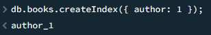

### Запит:
```js
db.books.find({ author: "Іван Франко" }).explain("executionStats");
```
### Результат:

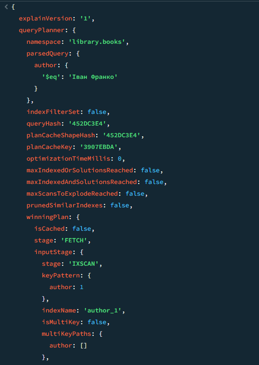
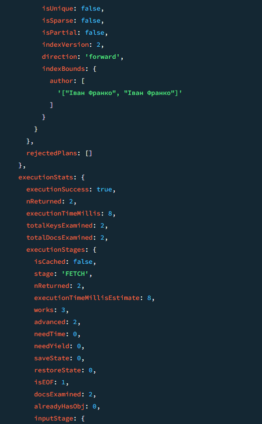
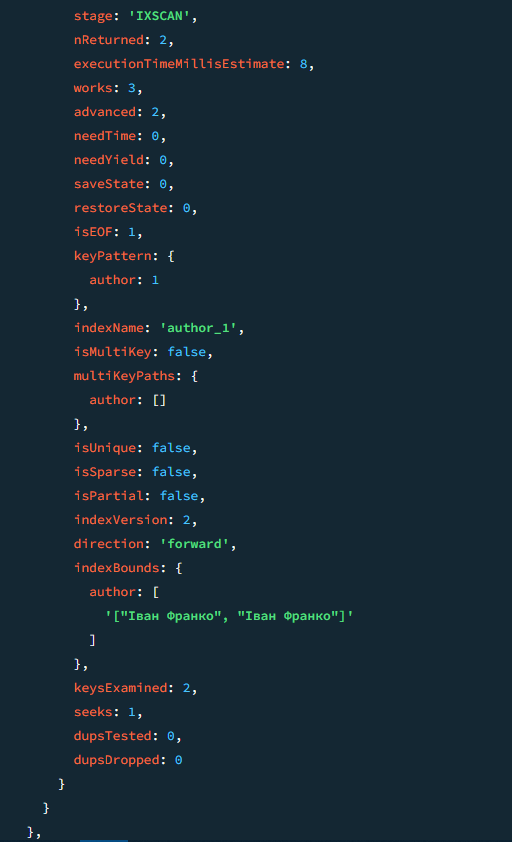
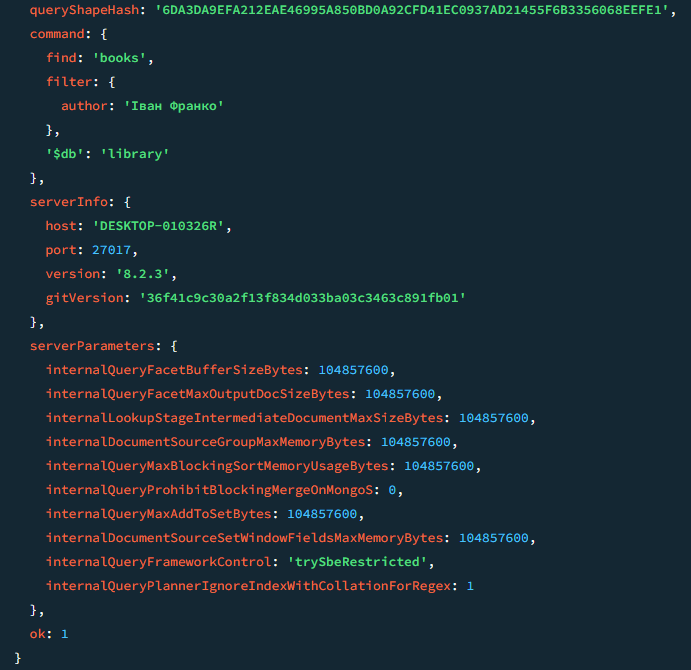

І справді: індексований запит виконався на краплю швидше (у цьому випадку на краплю, бо сама БД невелика + запит нескладний, тому різниця не така велика).


# РІВЕНЬ 2
## Крок 1: Агрегаційні запити.
### 1
```js
db.books.aggregate([
  { $unwind: "$genres" },
  { $group: { _id: "$genres", count: { $sum: 1 } } },
  { $sort: { count: -1 } }
]);
```
### Результат:

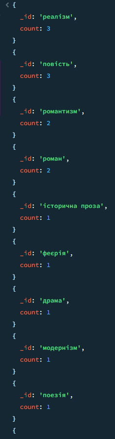

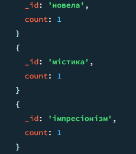

### 2
```js
db.users.aggregate([
  {
    $project: {
      username: 1,
      email: 1,
      borrowed_count: { $size: "$borrowed_books" }
    }
  },
  { $sort: { borrowed_count: -1 } },
  { $limit: 5 }
]);
```
### Результат:

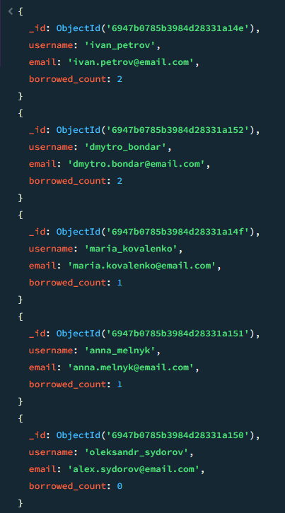


## Крок 2: Об'єднання колекцій з $lookup.
Перший крок - додавання ID авторів до книг:
```js
db.authors.find().forEach(function(author) {
  db.books.updateMany(
    { author: author.name },
    { $set: { author_id: author._id } }
  );
});
```
### Результат:
Немає виводу.

Другий крок - сам запит з lookup:
```js
db.books.aggregate([
  {
    $lookup: {
      from: "authors",
      localField: "author_id",
      foreignField: "_id",
      as: "author_details"
    }
  },
  { $unwind: "$author_details" },
  {
    $project: {
      title: 1,
      "author_details.name": 1,
      "author_details.birth_year": 1,
      publication_year: 1,
      pages: 1
    }
  }
]);
```
### Результат:

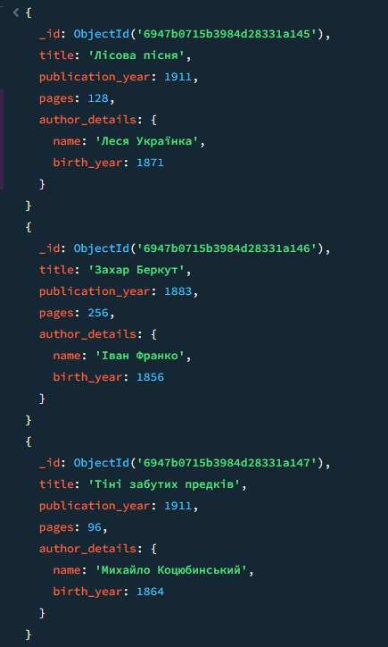
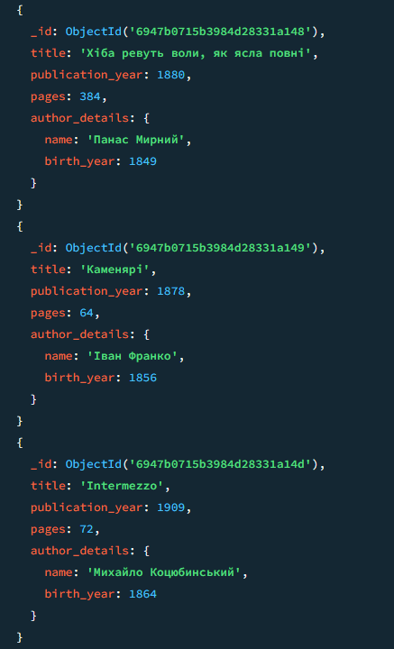


## Крок 3: Агрегаційний запит з використанням pipeline.
```js
db.books.aggregate([
  {
    $lookup: {
      from: "authors",
      localField: "author",
      foreignField: "name",
      as: "author_info"
    }
  },
  { 
    $unwind: "$author_info" 
  },
  {
    $project: {
      _id: 0,
      title: 1,
      author: 1,
      "author_birth_year": "$author_info.birth_year",
      "author_bio": "$author_info.biography"
    }
  }
]);
```
### Результат:

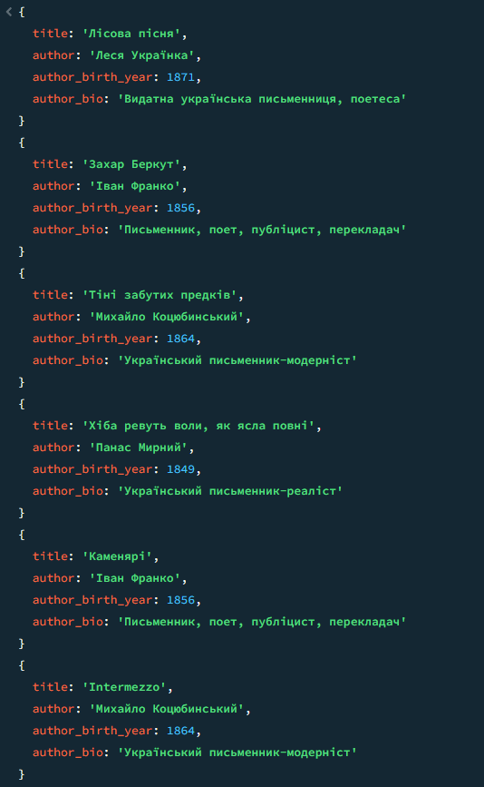


## Крок 4: Реалізувати текстовий пошуку з text індексом.
Для початку необхідно створити індекс:
```js
db.books.createIndex({ 
  title: "text", 
  description: "text" 
});
```

Далі напишемо запит для демонстрації роботи цього індексу:
```js
db.books.find(
  { $text: { $search: "повість кохання" } },
  { score: { $meta: "textScore" } }
  )
  .sort({ score: { $meta: "textScore" } 
});
```
### Результат:

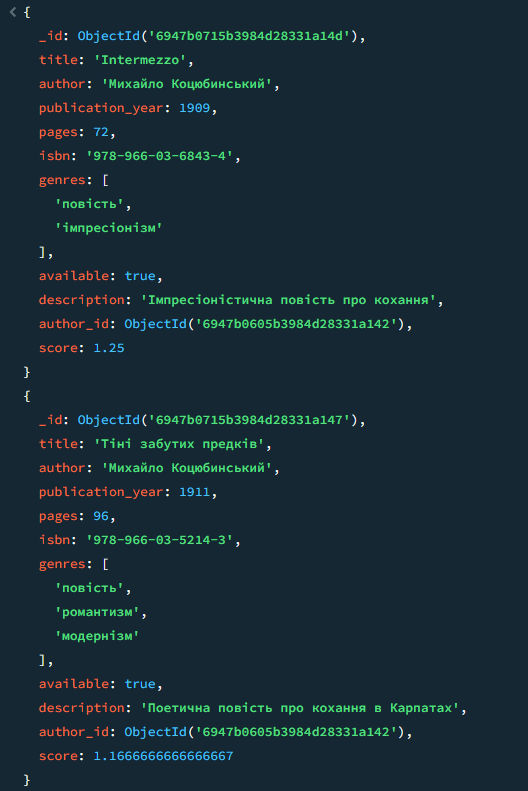
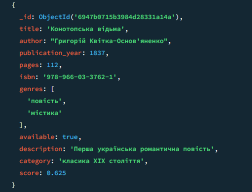


## Крок 5: Створити представлення для складних запитів.
```js
db.createView(
  "detailed_books",
  "books",
  [
    {
      $lookup: {
        from: "authors",
        localField: "author",
        foreignField: "name",
        as: "author_info"
      }
    },
    { $unwind: "$author_info" },
    {
      $project: {
        _id: 0,
        title: 1,
        genre: "$genres",
        pages: 1,
        author_name: "$author",
        author_bio: "$author_info.biography",
        author_birth_year: "$author_info.birth_year"
      }
    }
  ]
);
```
### Результат:

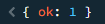

Тепер переглянемо наше представлення:
```js
db.detailed_books.find()
```

### Результат:

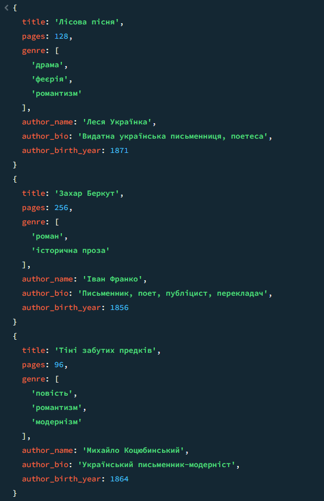
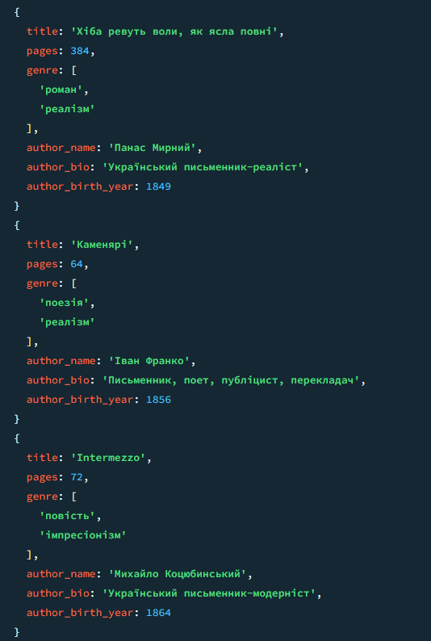


# РІВЕНЬ 3
## Крок 1: Реалізувати валідацію схеми.
Суть - перевірка даних, які будуть вставлятись у БД.
```js
db.runCommand({
  collMod: "books",
  validator: {
    $jsonSchema: {
      bsonType: "object",
      required: ["title", "author", "publication_year", "available"],
      properties: {
        title: {
          bsonType: "string",
          minLength: 1,
          maxLength: 200,
          description: "Назва книги обов'язкова, від 1 до 200 символів"
        },
        author: {
          bsonType: "string",
          minLength: 1,
          description: "Автор обов'язковий"
        },
        publication_year: {
          bsonType: "int",
          minimum: 1000,
          maximum: 2100,
          description: "Рік видання має бути між 1000 та 2100"
        },
        pages: {
          bsonType: "int",
          minimum: 1,
          maximum: 10000,
          description: "Кількість сторінок має бути додатнім числом"
        },
        isbn: {
          bsonType: "string",
          pattern: "^978-\\d{1,5}-\\d{1,7}-\\d{1,7}-\\d{1}$",
          description: "ISBN має відповідати стандартному формату"
        },
        available: {
          bsonType: "bool",
          description: "Доступність обов'язкова"
        }
      }
    }
  },
  validationLevel: "strict"
});
```
### Результат:

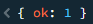

Тепер щоб перевірити роботу валідації, необхідно спробувати вставити якийсь запис, у якому буде невідповідність якого поля:
```js
db.books.insertOne({
  title: "Тестова книга",
  author: "Тестовий автор",
  publication_year: 3000,
  available: true
});
```
### Результат:


Отже все працює так, як мало б.


## Крок 2: Реалізувати TTL-індекси.
TTL-індекси придумані для того, щоб видаляти лишнє і прибирати "сміття".
В даному випадку буде створена нова колекція password_resets, в яку буде вставлено тестовий запис:
```js 
db.password_resets.insertOne({
  user_email: "ivan.petrov@email.com",
  code: "123456",
  createdAt: new Date()
});
```
Після цього буде створено TTL-індекс, який буде дивитись на createdAt і видаляти цей запис після 60-секундного терміну:
```js
db.password_resets.createIndex(
  { "createdAt": 1 }, 
  { expireAfterSeconds: 60 } 
);
```
Тепер якщо переглянути вміст новоствореної колекції, побачимо таке:
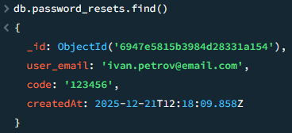

Тепер, якщо почекати 60 секунд і знову переглянути зміст нової колекції, картина відрізнятиметься:
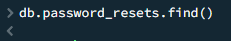

Отже, індекс працює так, як і мав би.


# Висновок:
У ході виконання лабораторної роботи, я познайомився з абсолютно новою технологією для мене - MongoDB. Реалізував на ній прості (і не зовсім) завдання, навчився писати запити, трішки підівчив синтаксис мови.